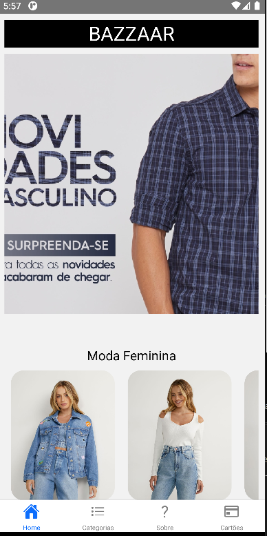
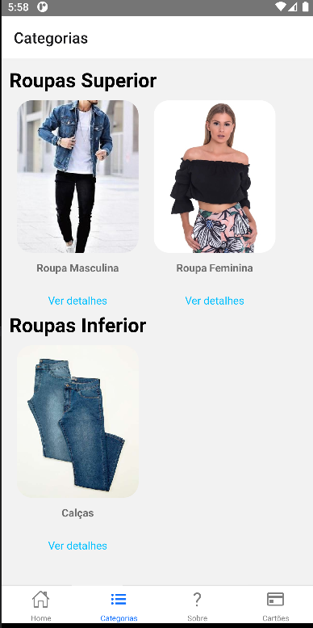
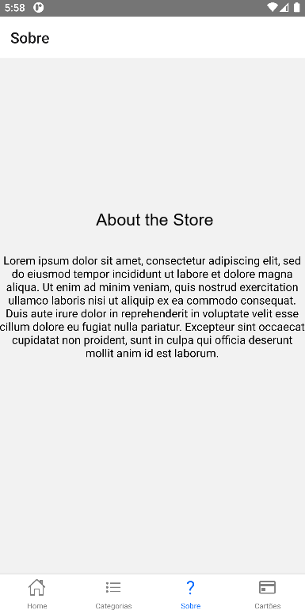
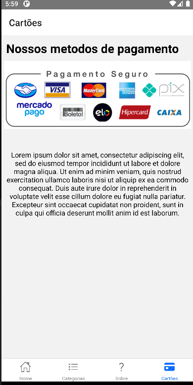

# React Native Loja Roupas
App criado para exemplificar o uso de navegações com o React Navigation para uma atividade do Senac, criação de um app de loja de roupas.

 

## Instalação
1. Clone esse repositório ou faça o download dos arquivos
2. Abra o projeto no Visual Studio Code
3. Abra o Terminal e execute o comando `npm install` para instalar os módulos do Node.
4. Use o comando `react-native link` para que todos os assets sejam linkados ao projeto
5. Execute o projeto com `react-native run-android`
6. Enjoy!

## Capturas de tela

<table>
 <tr>
    <td></td>
    <td></td>
    <td></td>
    <td></td>
  </tr>
</table>

## Desenvolvido com...

* [React Native](https://reactnative.dev)
* [React Navigation](https://reactnavigation.org)
* [React Native Modal](https://github.com/react-native-modal/react-native-modal)
* [React Native Vector Icons](https://github.com/oblador/react-native-vector-icons)

#### Ferramentas

  - [**VS CODE**](https://code.visualstudio.com/)
  - [**NPM**](https://npm.dev/)
  - [**React-Native**](https://npm.dev/)

  <h1 align="center">Siga-me</h1>
  
Made with 💜 by Adriana Almeida 👋🏻  [See my Linkedin](https://www.linkedin.com/in/adriana-almeida-77a7441a4/)

  
   
  
   
---------------END--------------

